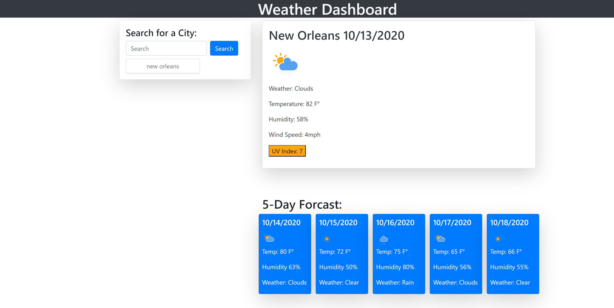
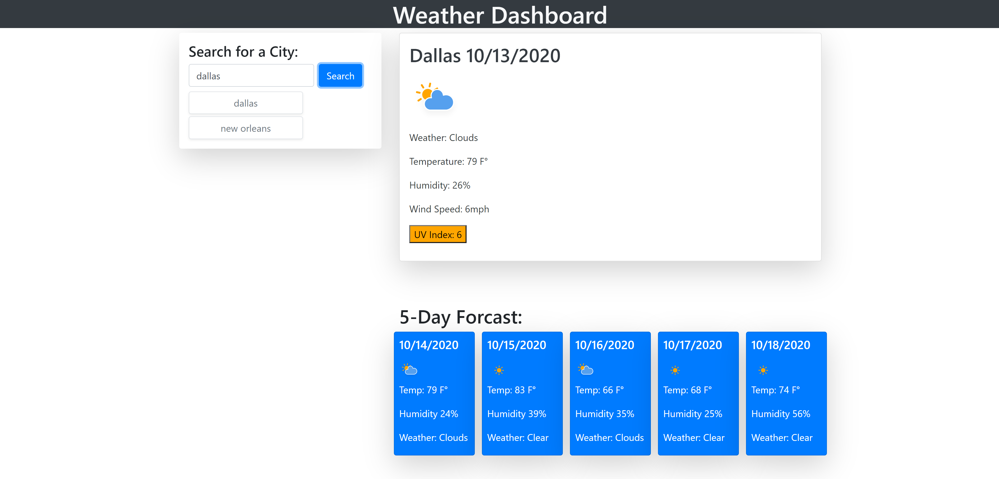
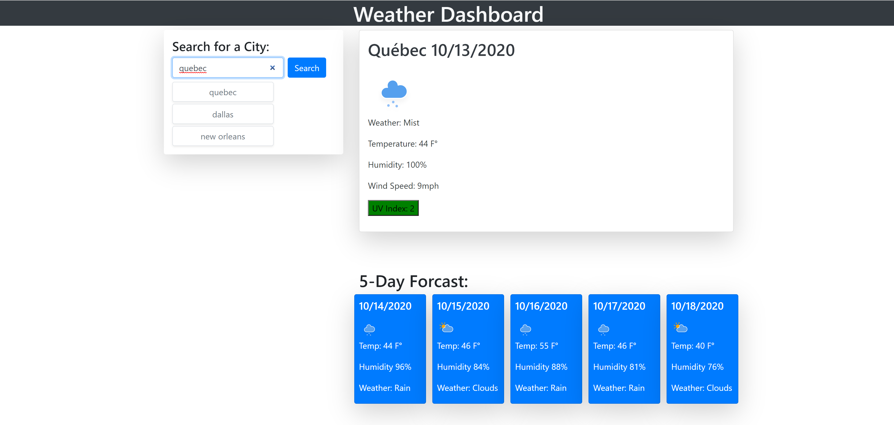

# WeatherAPI

## Purpose

To create a weather page that takes user input and pulls data from a weather API

## Method

Webpage takes user defined input, pulls data from API based off of location, and appends relevant data to page to show weather type, the date, an icon, a five day forecast, humidity, and UV index. Program also stores previous user input 

## End result

 </img>

List grows as user input is added

 </img>

etc.

 </img>

## Webpage 

https://jks2090.github.io/WeatherSearch/
